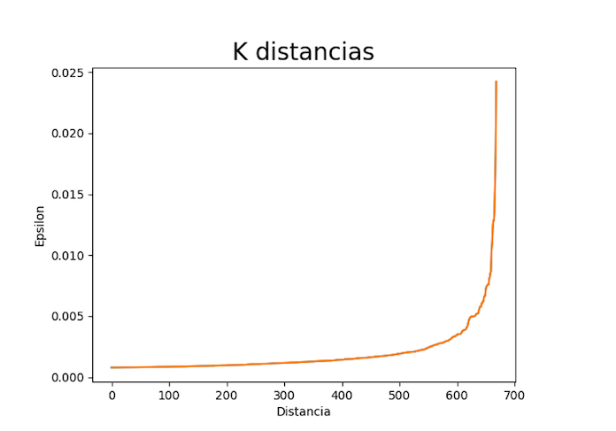
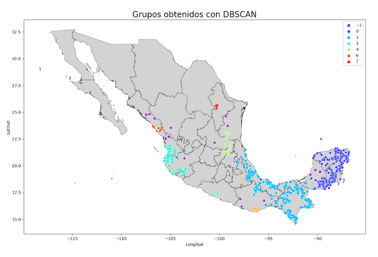

```{r include=FALSE}
library(dplyr)
library(lubridate)
library(spThin)
library(dplyr)
library(dbscan)
library(reticulate)

use_python("/usr/local/bin/python3")
```


#### Aprendizaje Máquina
> - Salvador Garcilita
> - José Andrés Villanueva
> - Vianey Galindo Añel

## Patrones espaciales en la distribución del halcón murcielaguero en México

<div align="justify">El halcón murcielaguero (Falco rufigularis) es una especie de ave rapaz perteneciente a la familia Falconidae (orden: Falconiformes) ampliamente distribuida en América; históricamente, se encuentra desde el sur de Sonora y Tamaulipas (siendo México el extremo norte de su distribución), distribuyendose a lo largo del país en tierras bajas tropicales y subtropicales de hasta 1500 msnm; el resto de su distribución abarca centroamérica casi en su totalidad y se extiende hasta Ecuador, Perú, Bolivia, Paraguay, Argentina y Brasil; no obstante, es probable que su distribución y abundancia actual hayan cambiado considerablemente, contemplando el intenso cambio de uso de suelo y destrucción de hábitat al que se ha visto sometido el neotrópico, además del uso indiscriminado de pesticidas como el Dicloro Difenil Tricloroetano (DDT).
Se ha propuesto la existencia de tres subespecies en F. rufigularis; F. r. petoensis, F. r. rufigularis y F. r. ophryophanes; la subespecie perteneciente a México y centroamérica es petoensis y, al igual que las demás, no se considera migratoria, con individuos establecidos a menudo en parejas en el mismo sitio durante todo el año, y en el caso de los juveniles, dispersandose de las áreas de cría y realizando si acaso migraciones locales. No obstante, la población de México aún perteneciendo a la misma subespecie, dada la heterogeneidad del medio respecto a biomas y ejes montañosos, es probable que pueda ser dividida en distintas subpoblaciones si se usan las herramientas adecuadas y se cuenta con los suficientes datos. F. rufigularis, dada su amplia distribución y abundancia en hábitats propicios, se encuentra listado en la categoría de menor preocupación (Least Concern) de la lista roja de la Unión Internacional para la Conservación de la Naturaleza (IUCN, por sus siglas en inglés), no obstante, se estima que su tendencia poblacional es decreciente. 


Una de las particularidades más notorias de las aves como grupo de estudio, es el importante aporte que realizan miembros de la sociedad que no están especializados en la toma de datos debido al interés que despiertan en la gente; estos datos registrados por aficionados poseen gran valor ecológico y deben contemplarse para actualizar y mejorar el estado de conocimiento de las especies, así como fortalecer los lazos entre el sector académico y la sociedad. En particular, eBird es una iniciativa de ciencia ciudadana del Laboratorio de Ornitología de Cornell y la Sociedad Nacional Audubon creada en 2002, que permite recopilar de forma masiva datos colectados por observadores de aves (científicos ciudadanos) usando protocolos estandarizados. Esta fuente de datos puede ser y ha sido aprovechada para evaluar y adaptar las estrategias de conservación de aves en distintas partes del mundo, puesto que ofrece la posibilidad de mejorar nuestro entendimiento de las aves, los hábitats que requieren y cómo protegerlas.


El nicho ecológico es un concepto que ayuda a explicar la distribución geográfica de una especie dentro de un ecosistema, contemplando factores bióticos y abióticos, así como el papel de los individuos dentro de éste. El modelado de nicho ecológico es útil para diversas áreas de estudio, donde se toman decisiones contemplando información biológica y estadística procesada con ayuda de Sistemas de Información Geográfica (SIG) y otras herramientas digitales como lenguajes de programación, que permiten analizar grandes cantidades de datos. Su objetivo es modelar los requisitos ambientales de la especie y así poder identificar las áreas adecuadas para ella, además es usada para la predicción de distribuciones, proponer áreas de conservación e incluso mapeo de información de importancia médica como aumento en la distribución de especies que son vectores de enfermedades; Existen tres principios que deben ser contemplados al escoger las variables predictivas:  variables cuyos valores no son afectados por la especie, evitar el uso de variables puramente espaciales, y usar variables causales. La construcción de estos modelos es un proceso de clasificación que debe generar un valor numérico y reciben diferentes denominaciones según su interpretación; en los registros de la especie el investigador debe prestar especial atención al margen de error y sesgo que puedan existir en la dispersión, las interacciones biológicas y cambios ambientales. </div>


## Objetivo

<div align="justify">El objetivo del presente artículo es revelar cuál es la distribución actual y potencial a futuro de F. rufigularis en México en función de las variables bioclimáticas empleando una metodología que podría servir no sólo para aumentar nuestro entendimiento sobre los patrones biogeográficos de ésta especie, sino la de todo el género Falco, permitiendo conocer si la distribución de la especie se mantendrá constante en el tiempo o si habrá algún cambio considerable, así como detalles en los patrones de su distribución que sólo es posible conocer gracias a 1) la existencia de datos colectados de forma colectiva y sistemática durante largos periodos de tiempo y 2) el uso de técnicas estadísticas y de aprendizaje de máquina (Machine Learning) que permiten procesar estos datos y encontrar patrones donde de otra forma podrían pasar desapercibidos (Kelling et al. 2013).</div>

## Metodología

### Obtención y pre-procesamiento de datos
<div align="justify">Los datos empleados para el análisis se obtuvieron de la base de datos de eBird (eBird Basic Dataset, 2021), obteniendo los registros de F. rufigularis para los años 2010-2020 a lo largo de todo el país. El procesamiento de datos en éste trabajo se realizó empleando los lenguajes de programación R y Python. 
Una vez obtenida la base, se empleó el paquete de R AUK para procesar los datos, eliminando registros duplicados debido a las listas compartidas por observadores y manteniendo únicamente registros correspondientes al periodo de años 2010-2020. </div>

<br>
<br>

#### Visualización de los registros
```{r echo = FALSE}
# lectura de datos 
halcones <- read.csv("./Halcones_mexico.csv", header = T)
#table(halcones$common_name) # las categorias de especies en la tabla 
#halcones$observation_date <- as.Date(halcones$observation_date, format = "%Y-%m-%d")
#summary(halcones$observation_date)

# filtramos solo la especie de interés 
halcones <- halcones %>% 
  dplyr::select(common_name, latitude, longitude) %>% 
  dplyr::filter(common_name=="Bat Falcon") 

# %>% select(common_name, latitude, longitude)

plot(halcones$longitude, halcones$latitude)
```

<div align="justify">Además,  dado el sesgo en la distribución de registros de observaciones en eBird (sesgo de muestreo) y con el fin de generar un modelo estadísticamente más confiable, se realizó un filtrado espacial empleando el paquete de R spThin, obteniendo con el algoritmo un punto por cada cinco kilómetros, y disminuyendo así la autocorrelación espacial en las observaciones, realizando finalmente los modelos con 669 registros.</div> 

```{r eval = TRUE, results = "hide"}

thinned_dataset_full <- thin( loc.data = halcones, 
        lat.col = "latitude", long.col = "longitude", 
        spec.col = "common_name", #campo con la especie
        thin.par = 5, reps = 10, #thin par es la distancia en km para separar los puntos
        locs.thinned.list.return = TRUE, 
        write.files = F, 
        max.files = 5, #Numero de posibles soluciones de seleccion
        out.dir = "XXX", 
        out.base = "bat_thinned", 
        write.log.file = TRUE,
        log.file = "bat_thinned_file.txt" ) #un resumen del proceso y sus resultados


 bat <- thinned_dataset_full[1] %>% 
        as.data.frame()
```

### Modelo de distribucion espacial

<div align="justify">Se realizó un modelo de nicho ecológico para la especie, considerando las 19 variables ambientales de WorldClim, las cuales fueron: (BIO1) temperatura media anual, (BIO2) rango diurno medio, (BIO3) isotermalidad, (BIO4) estacionalidad de la temperatura, (BIO5) temperatura máxima del mes más cálido, (BIO6) temperatura mínima del mes más frío, (BIO7) rango anual de temperatura, (BIO8) temperatura media del trimestre más húmedo, (BIO9) temperatura media del cuarto más seco, (BIO10) temperatura media del trimestre más cálido, (BIO11) temperatura media del cuarto más frío, (BIO12) precipitación anual, (BIO13) precipitación del mes más húmedo, (BIO14) precipitación del mes más seco, (BIO15) estacionalidad de la precipitación, (BIO16) precipitación del cuarto más húmedo, (BIO17) precipitación del cuarto más seco, (BIO18) precipitación del trimestre más cálido, (BIO19) precipitación del cuarto más frío. Para implementar esto fue necesario el uso de las librerias especializdas maptools, raster y dismo. </div>

```{r message = FALSE, warning = FALSE}
library(rsample)
library (maptools)
library(raster)
library(dismo)
library(randomForest)
library(rpart)
library(ggplot2)

set.seed(0)
bat <- read.csv("./bat_thinned_file.csv", header = TRUE)

data("wrld_simpl")

# variables  bioclimaticas predictoras  
wc <- raster::getData("worldclim", var = "bio", res = 10)

# extraer datos climáticos de las ubicaciones de nuestras observaciones. 
clima_bat <- raster::extract(wc, bat[,1:2]) 
head(clima_bat)

# añado columna de presencia 1 / ausencia 0 
pa <- c(rep(1, 668)) 
clima_bat <- cbind(clima_bat, pa)

#### análisis exploratorio 
plot(bat[,1:2], cex = 0.5, col = "blue")
plot(wrld_simpl, add = T)

# BIo 1: Annual Mean Temperature 
# Bio 12: Annual precipitation 
plot(clima_bat[,1]/10, clima_bat[,12], xlab = "Bio1", ylab = "Bio12")

### modelamiento de presencia vs random expectation. 
# definicion random expectation: también llamada background, o random absence data, 
# es lo que obtendrías si la especie no tuviera ninguna preferencia por ninguna de 
# las variables predictora (u otras variables que no estén correlacionadas con las 
# variables predictoras).

# la extensión de la distribución de la especie
ext <- raster::extent(SpatialPoints(bat[,1:2]))

mex <- getData("GADM", country = "MEX", level = 1)

# generamos 3000 muestras aleatorias de extent 
random_ar <- sampleRandom(wc, 3000, ext = ext) # ext = para limitar el muestreo al
# área dentro de la extensión. 

# generamos columna de presencia 1 ausencia 0 
par <- c(rep(0, 3000))
random_ar <- cbind(random_ar, par)

bat_completor <- rbind(clima_bat, random_ar) %>% 
  as.data.frame() 

bat_split <- initial_split(bat_completor, strata = pa)
train_data <- training(bat_split)
test_data <- testing(bat_split)

cart <- rpart(pa~., data=train_data)

#para encontrar el hiperparametro mtry
trf <- tuneRF(train_data[, 1:19], train_data[, 'pa'])
mt <- trf[which.min(trf[,2]), 1]
mt

rrf <- randomForest(train_data[, 1:19], train_data[, 'pa'], mtry=mt)
plot(rrf)
varImpPlot(rrf)

eva <- evaluate(test_data[test_data$pa==1, ], test_data[test_data$pa==0, ], rrf)
eva

plot(eva, 'ROC')

#predictions
rp <- predict(wc, rrf, ext=mex)
plot(bat$Longitude, bat$Latitude)
plot(rp)
```


### Regionalización de poblaciones 

<div align="justify">Para entender la distribución de la especie en el país y su potencial agrupamiento en subpoblaciones, se aplicó un algoritmo DBSCAN (Density-Based Spatial Clustering of Applications with Noise, por sus siglas en inglés), una técnica de agrupamiento de aprendizaje de máquina basado en densidad de puntos que permite clasificar en grupos datos no etiquetados de forma no supervisada y que tiene un desempeño apropiado con datos espaciales . DBSCAN requiere de tres parámetros (en el contexto del Machine Learning, hiper parámetros) que fueron definidos por nosotros; 1) un valor epsilon, que es el criterio de distancia mínima entre dos puntos para ser considerados vecinos y formar un grupo (subpoblación en el contexto del presente trabajo), 2) mínimo de muestras, que es la cantidad mínima de registros agrupados para ser considerados un grupo y no valores atípicos (registros aislados) y 3) una métrica para calcular la distancia entre puntos.

Para elegir el valor más apropiado para epsilon, se realizó primero un modelo de vecinos más cercanos (Nearest Neighbours), otro algoritmo de aprendizaje de máquina que agrupa los datos en función de un número de clusters determinado por el investigador, permitiendo calcular la distancia a los n puntos más cercanos de cada registro, ordenarlos y posteriormente graficarlos para observar el valor óptimo de epsilon, el cual se ve reflejado como el punto de máxima curvatura.</div>


```{r eval = FALSE, echo = FALSE}
kNNdistplot(bat, k = 4  )
abline(h = 0.55, lty = 2)
```

```{r eval = FALSE, echo = FALSE}
cl1<-dbscan(bat,eps=0.55,MinPts = 4)
hullplot(bat,cl1$cluster,  main = "Convex cluster Hulls, eps= 0.55")
```


```{python eval = FALSE}

import pandas as pd
import numpy as np
import matplotlib.pyplot as plt
import seaborn as sns
from sklearn.neighbors import NearestNeighbors
from sklearn.cluster import DBSCAN
import geopandas as gpd

# aquí hay que conectar la tubería, en el chunk anterior se crea el objeto bat como data frame en R. Aquí hay que conectar ese data frame con un pandas data frame.

bat = pd.read_csv("./Bat_thinned_file.csv")

# la primera columna del arreglo debe ser latitud
latitud = bat["latitude"]

# la segunda columna del arreglo debe ser longitud
longitud = bat["longitude"]

# creo un data frame con el orden necesario:
bat = pd.DataFrame([latitud, longitud]).transpose()

# Ajustamos el modelo de Nearest Neighbours transformando los valores en radianes
neigh = NearestNeighbors(metric = 'haversine', n_neighbors=5)
nbrs = neigh.fit(np.radians(bat))
distances, _ = nbrs.kneighbors(np.radians(bat))

# Ordenamos las distancias de menor a mayor y observamos el punto (distancia) donde se presenta la mayor curvatura (punto de inflexión en las distancias)
distances = np.sort(distances, axis=0)
distances = distances[:,1]
plt.plot(distances)
plt.xlabel("Distancia")
plt.ylabel("Epsilon")
plt.title("K distancias", fontsize=20)
plt.show()

```


```{python eval = FALSE}

# Ajustamos el modelo transformando los valores en radianes
dbscan = DBSCAN(eps=0.010, min_samples=4, metric='haversine') # mejores parámetros so far: eps=0.010, min=4

# vale la pena explorar más combinaciones...
dbscan.fit(np.radians(bat))

# Obtenemos la etiqueta del clúster para cada observación
clusters = dbscan.labels_

## parte espacial: mapa de mexico (CARGAR .SHAPE DE MÉXICO). 
mexico = gpd.read_file(".shp")

## grafica sobre mapa
ax = mexico.plot(color = "lightgrey", linestyle = ":", edgecolor = "black")
sns.scatterplot(data = bat, x ="longitude", y = "latitude", hue = clusters,  palette="rainbow", ax=ax)
plt.xlabel("Longitud")
plt.ylabel("Latitud")
plt.title("Grupos obtenidos con DBSCAN", fontsize=20)
plt.show()
```




## Resultados

Falco rufigularis es una especie que se encuentra principalmente en la parte sur del país, mostrando una continua idoneidad en las costas y en la península de Yucatán (el modelo generado tiene un AUC de 0.90 ).


Respecto al agrupamiento de los registros, el algoritmo DBSCAN arrojó ocho grupos, con lo cual podríamos entender que la población total de F. rufigularis en México se divide en 8 subpoblaciones (etiquetadas de cero a siete). En color morado y con etiqueta -1, se representan los datos atípicos (o ruido, en el contexto de éste algoritmo), los cuales son registros que no cumplieron con el criterio de permanencia a ningún grupo por la proximidad. 
```{r}

```


## Conclusión

<div align="justify">El halcón murcielaguero presenta una amplia distribución en México, la cual está altamente correlacionada con la idoneidad ambiental para la especie. Sus poblaciones más abundantes y extensas se encuentran en el sureste del país, la cual es una región con fuertes presiones antropogénicas. Debido a su abundancia y distribución en la región neotropical en el país, así como a su sensibilidad a la perturbación, es posible que ésta especie sea un buen indicador ambiental para conocer el impacto de las actividades antropogénicas en otras rapaces tropicales presentes en la región pero que debido a menor densidad poblacional y hábitos más esquivos son difíciles de estudiar y monitorear. Por otro lado, los modelos de agrupamiento no supervisado resultaron ser una gran herramienta para analizar los patrones espaciales en la distribución de la especie, por lo que se sugiere su uso al momento de analizar datos de otras especies.</div>


